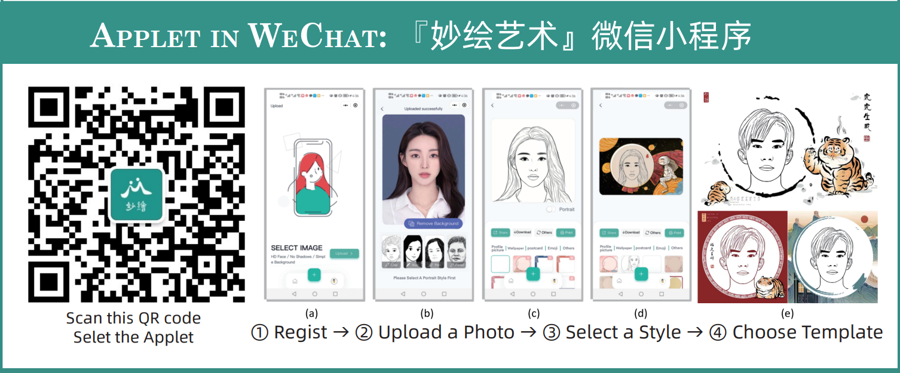

## Hi there 👋

🙋‍ AiArt Group by [Fei Gao](https://github.com/fei-aiart)

[2015-2026] is at [the School of Computer Science and Technology](http://computer.hdu.edu.cn/), Hangzhou Dianzi University ([HDU](https://www.hdu.edu.cn/)). 

[2024-Now] is currently with the [Intelligent Information Processing (IIP) Lab.](https://iip-xdu.github.io/) and [Hangzhou Institute of Technology](https://hz.xidian.edu.cn/), at [Xidian University](https://www.xidian.edu.cn/). 

智能视觉艺术小组：杭州电子科技大学-计算机学院 & 西安电子科技大学-杭州研究院

🌈 We mainly apply machine learning techniques to computer vision problems. Our research interests include degraded image analysis, image generation, biomedical image analysis, etc. 

🧙 我们的主要研究研究兴趣为人工智能和计算机视觉，包括低质图像分析、视觉内容生成AIGC、医学影像分析、绘画机器人等。

<!--

🧙 We have developed a series of demonstrations for artistic portrait drawing generation (APDG), including an applet, a robot, and a printer. Our demonstrations are easy to use and have achieved excellent user experience in various exhibitions. You can try our demos by scanning the following QR code （"妙绘艺术"微信小程序）.

**Here are some ideas to get you started:**

🙋‍♀️ A short introduction - what is your organization all about?
🌈 Contribution guidelines - how can the community get involved?
👩‍💻 Useful resources - where can the community find your docs? Is there anything else the community should know?
🍿 Fun facts - what does your team eat for breakfast?
🧙 Remember, you can do mighty things with the power of [Markdown](https://docs.github.com/github/writing-on-github/getting-started-with-writing-and-formatting-on-github/basic-writing-and-formatting-syntax)
-->
